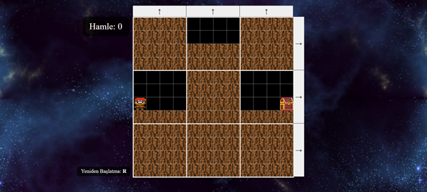
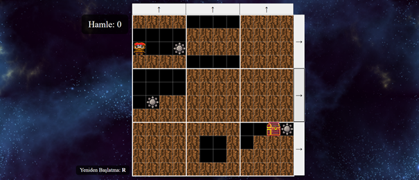
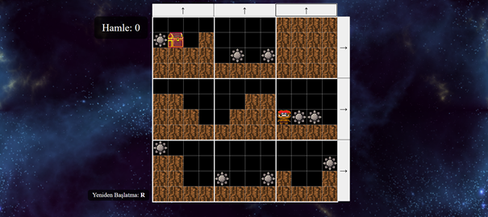

# Maze of Mind 🧠🗺️

Maze of Mind, bulmaca türünde bir platform oyunudur. Oyun, [Maze of the Mini-Taur](https://z-richman.itch.io/maze-of-the-mini-taur) oyunundan ilham alınarak geliştirilmiştir.

## 🎮 Oynanış

- Oyun toplamda **3 seviye** içerir: Kolay, Orta ve Zor.
- Oyuna başla butonuyla giriş yapılır.
- Seviye başladığında ekranda yön tuşları görünür. Bu tuşlarla:
    - Satır veya sütun blokları sirkülasyon şeklinde kaydırılır.
    - Oyuncu karakteri yön tuşlarıyla hareket ettirilir:
        - `→`: sağa gider
        - `←`: sola gider
        - `↑`: zıplar
- Amaç, blokları doğru şekilde kaydırarak **sandığa** ulaşmaktır.
- Sandığa ulaşıldığında bir **alkış efekti** çalar ve bir sonraki seviyeye geçilir.
- Tüm seviyeler başarıyla tamamlandığında **tebrik mesajı** gösterilir.

## 📸 Oyun Görselleri

### 🟢 Kolay Seviye Başlangıç

### ⚠️ Tuzaklı Orta Seviye

### 🏁 Zor Seviye - Final

### 🧠 Tuzaklar

- 1. seviyeden itibaren **tuzaklar** oyuna dahil olur.
- Oyuncu tuzağa değerse, ekranda bir uyarı ve yeniden başlama seçeneği çıkar.
- Seviye, sandığa ulaşana kadar tekrar edilir.

### 🔁 Yeniden Başlatma

- Oyuncu, hamlelerinden memnun kalmazsa **R** veya **r** tuşlarıyla seviyeyi baştan başlatabilir.

### 📊 Hamle Sayacı

- Ekranın köşesinde yapılan hamle sayısını gösteren bir sayaç bulunur.

## ✨ Özellikler

- Karakter hareketleri (yürüme, zıplama)
- 3 farklı zorluk seviyesinde bölüm
- Çarpışma algılama sistemi
- Hamle takibi

## 📽️ Oynanış Videosu

[YouTube - Maze of Mind Gameplay](https://youtu.be/GQNcTEpHe5U)

## 🛠️ Kullanılan Teknolojiler

- HTML5
- CSS
- JavaScript (Canvas API)

## 🎨 Tasarım & Kaynaklar

- Karakter tasarımları **Pixilart** uygulamasıyla elle çizildi ve boyandı.
- Tuzak görseli: [Platform Trap Pack](https://bdragon1727.itch.io/platfrom-trap-and-weapon)
- Duvar görselleri: **Pixilart**
- Arka plan görseli: [Seamless Space Backgrounds - Screaming Brain Studios](https://screamingbrainstudios.itch.io/seamless-space-backgrounds)
- Platform yapısı matrisler kullanılarak kodlandı:
    - `0`: yol
    - `1`: duvar
    - `2`: hedef (sandık)
    - `3`: tuzak

### 🔊 Kullanılan Sesler

- Arka plan müziği: [YouTube](https://www.youtube.com/watch?v=ngWMQ0tUpmM)
- Kazanma efekti: [YouTube Short](https://www.youtube.com/shorts/N0VB82WW0uo)

---

**Temel alınan oyun**: [Maze of the Mini-Taur](https://z-richman.itch.io/maze-of-the-mini-taur)  
**Çizim sitesi**: [Pixilart](https://www.pixilart.com/)
